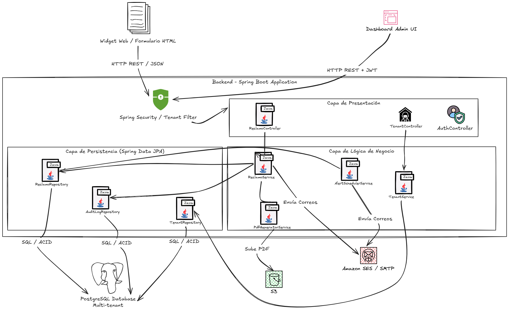
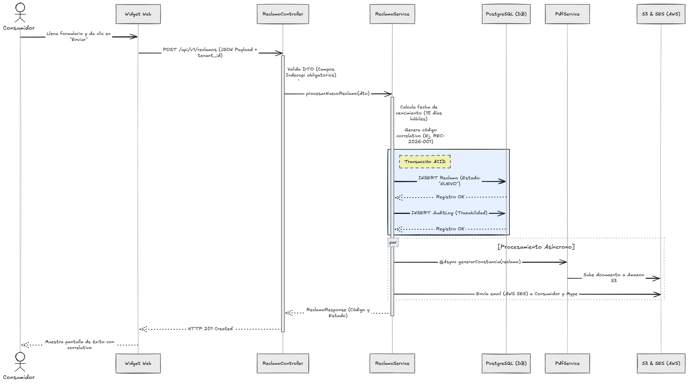
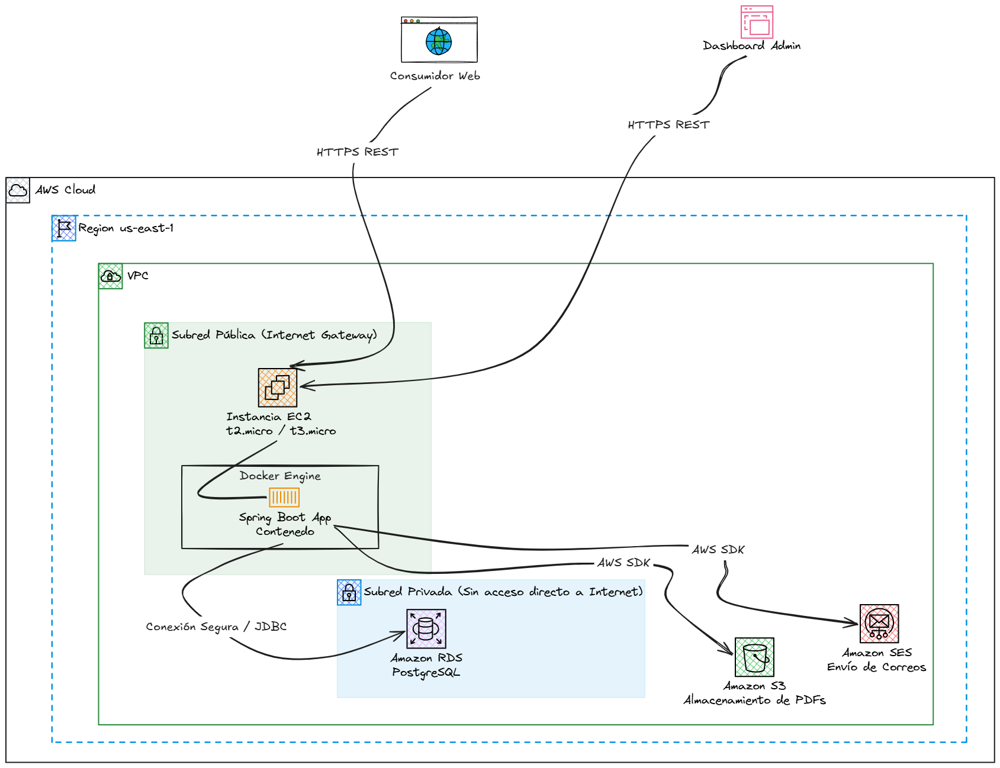

# Libro de Reclamaciones Inteligente (SaaS)

Sistema de gestión automatizada de cumplimiento normativo (Indecopi) diseñado para Mypes peruanas, construido con arquitectura multi-tenant.

---

## arc42 Documentación de Arquitectura

### 1. Introducción y Objetivos

#### 1.1 Contexto del Negocio y Requerimientos Principales
En el Perú, el Código de Protección y Defensa del Consumidor (y sus recientes modificatorias como la Ley N° 31435) obliga a toda empresa que ofrezca bienes o servicios a contar con un Libro de Reclamaciones y responder en un plazo máximo de **15 días hábiles**.

Las Mypes con presencia digital suelen gestionar esto mediante formularios básicos (Google Forms, correos electrónicos), lo que genera un alto riesgo de:
- Pérdida de tickets por desorganización.
- Vencimiento de plazos legales que resultan en multas severas por parte de Indecopi (hasta 450 UIT).
- Ausencia de pruebas o trazabilidad en caso de una auditoría estatal.

Este proyecto propone la construcción de un **SaaS B2B Multi-tenant** que centralice la recepción de quejas, automatice la emisión de constancias legales en PDF (Hoja de Reclamación) y orqueste un sistema de alertas proactivas para prevenir infracciones.

#### 1.2 Metas de Calidad (Quality Goals)
Las decisiones de arquitectura estarán impulsadas por los siguientes atributos de calidad, ordenados por prioridad:

1. **Aislamiento y Privacidad (Seguridad):** Al procesar Datos Personales (DNI, teléfonos, correos), el sistema debe cumplir con la Ley N° 29733 (Ley de Protección de Datos Personales). Los datos del *Tenant A* (Empresa 1) deben estar estrictamente aislados del *Tenant B* (Empresa 2).
2. **Trazabilidad (Auditoría):** Toda acción sobre un reclamo (cambio de estado, lectura, respuesta) debe generar un registro inmutable. El sistema debe poder probar ante Indecopi que la empresa gestionó el reclamo a tiempo.
3. **Fiabilidad (Reliability):** Un reclamo enviado por el consumidor no puede perderse bajo ninguna circunstancia (fallos de red o caídas del servidor). Debe garantizarse el registro de la transacción.
4. **Usabilidad de Integración:** La adopción del producto por parte de la Mype debe ser "Zero-IT". La inserción del formulario en sus tiendas web debe lograrse copiando y pegando un único *script* o etiqueta HTML.

#### 1.3 Stakeholders Principales
- **Dueño / Administrador de la Mype:** Busca cumplimiento legal automático, cero fricción de instalación técnica y alertas preventivas.
- **Consumidor Final:** Requiere un canal formal, ágil, responsivo y con un comprobante legal inmediato (código correlativo en PDF).
- **El Regulador (Indecopi):** Actor pasivo. Dicta las reglas de estructura de datos, formatos de exportación requeridos y plazos que el software debe cumplir.

### 2. Restricciones de la Arquitectura

Las decisiones de diseño de este sistema están limitadas por normativas gubernamentales peruanas y decisiones tecnológicas estratégicas para la fase de Producto Mínimo Viable (MVP).

#### 2.1 Restricciones Legales y Regulatorias
*   **Código de Protección y Defensa del Consumidor (Ley N° 29571 y modificatorias - Indecopi):**
    *   El sistema debe forzar la captura de campos obligatorios estandarizados (Datos del Consumidor, Datos del Bien/Servicio contratado, Detalle de la Reclamación/Queja).
    *   Debe generar automáticamente un código correlativo inalterable y secuencial por empresa (ej. `2026-000001`).
    *   Obligatoriedad de emitir y enviar una "Hoja de Reclamación" en formato inalterable (PDF) de manera inmediata al consumidor tras el registro.
*   **Ley de Protección de Datos Personales (Ley N° 29733):**
    *   Almacenamiento y tratamiento seguro de PII (Personal Identifiable Information) como DNI, CE, nombres, teléfonos y direcciones.
    *   El formulario web debe incluir obligatoriamente un *checkbox* de consentimiento para el tratamiento de datos personales, cuyo registro (fecha y hora) debe auditarse en la base de datos.

#### 2.2 Restricciones Técnicas
*   **Stack Tecnológico Base:** El backend debe desarrollarse utilizando **Java y Spring Boot**. La persistencia de datos relacionales y transaccionales se manejará en **PostgreSQL**.
*   **Aislamiento Multi-tenant:** Para optimizar costos en la fase MVP, se utilizará una arquitectura de base de datos de instancia única con separación lógica por inquilino (*Logical Isolation* usando `tenant_id` o esquemas separados), garantizando que las consultas nunca filtren datos entre empresas.
*   **Infraestructura:** El despliegue se realizará en contenedores utilizando **Docker** para garantizar consistencia entre entornos. El aprovisionamiento de la nube (**AWS**) deberá estar codificado utilizando **Terraform** (Infraestructura como Código - IaC).

#### 2.3 Restricciones Organizacionales y de Negocio
*   **Costos Operativos (Fase MVP):** La arquitectura inicial debe diseñarse para minimizar el gasto mensual en infraestructura de nube, prefiriendo servicios gestionados dentro de la capa gratuita (*Free Tier*) de AWS (como EC2 t2.micro, RDS micro, o alternativas serverless) durante las pruebas piloto con los primeros clientes.
*   **Equipo de Desarrollo:** Al ser desarrollado por un equipo reducido (un solo Ingeniero de Software), se priorizará la mantenibilidad, el código limpio y la automatización del despliegue (CI/CD) sobre optimizaciones de micro-rendimiento que añadan complejidad innecesaria en esta etapa.

### 3. Contexto y Alcance

Esta sección define los límites del sistema "Libro de Reclamaciones SaaS", identificando las interacciones con usuarios humanos y sistemas externos.

#### 3.1 Diagrama de Contexto (Business Context)

El siguiente diagrama muestra las entradas y salidas principales del sistema:

#### 3.2 Descripción de Actores y Sistemas Externos

**Actores Humanos:**
*   **Consumidor Final:** Usuario externo que interactúa únicamente con el formulario incrustado en la web de la Mype. Su flujo termina al recibir la confirmación y su comprobante PDF.
*   **Administrador de la Mype (Tenant):** Usuario autenticado que ingresa al panel de control (Dashboard) para gestionar los tickets de su empresa, redactar respuestas y descargar reportes obligatorios para Indecopi.

**Sistemas Externos (Dependencias):**
*   **Servicio de Correo Electrónico (Ej. Amazon SES / SMTP):** El sistema depende de una API de terceros para el envío transaccional de correos. Es crítico, ya que la ley exige que el consumidor reciba su constancia.
*   **Almacenamiento de Archivos (Ej. Amazon S3):** Sistema externo utilizado para almacenar de forma segura y duradera los PDFs generados y la evidencia adjunta (imágenes/documentos).

#### 3.3 Alcance de la Interfaz Técnica
*   La comunicación entre el widget web y el backend se realizará a través de una **API RESTful** expuesta bajo el protocolo HTTPS.
*   El sistema será completamente autocontenido en la gestión de tickets. No se integrará con pasarelas de pago, facturadores electrónicos ni CRMs externos en esta fase del MVP.

### 4. Estrategia de Solución

La estrategia de arquitectura se basa en un modelo **Backend como API RESTful** con un enfoque de **Aislamiento Multi-tenant Lógico**, priorizando la seguridad de datos, la trazabilidad normativa y la eficiencia en costos de infraestructura cloud.

#### 4.1 Decisiones Arquitectónicas Fundamentales

| Objetivo / Reto | Decisión de Arquitectura | Justificación / Beneficio |
| :--- | :--- | :--- |
| **Aislamiento Multi-tenant (Seguridad y Costos)** | **Base de datos única con columna de inquilino (`tenant_id`)** y filtros globales a nivel de ORM (Hibernate / Spring Data JPA). | Evita el sobrecosto de mantener una base de datos física por cada cliente (Mype), asegurando al mismo tiempo que ningún error en una consulta filtre datos entre empresas. |
| **Integridad de Datos Legales (Trazabilidad)** | **Transacciones ACID con PostgreSQL** y patrón *Audit Trail* (tabla inmutable de historial de eventos por ticket). | Al ser un software de cumplimiento legal (Indecopi), no es viable la consistencia eventual. Cada cambio de estado se registra de forma síncrona en una base de datos relacional robusta. |
| **Emisión del Comprobante PDF (Rendimiento)** | **Generación y subida asíncrona** del documento "Hoja de Reclamación" hacia almacenamiento externo (Amazon S3). | La generación de archivos PDF puede consumir recursos de CPU y demorar la respuesta web. Se delegará en un flujo asíncrono para mantener alta velocidad en el formulario web del consumidor. |
| **Alertas Preventivas de Plazos (Indecopi)** | **Trabajos programados (Cron Jobs con `@Scheduled` en Spring Boot)** que evalúan tiempos de caducidad. | Una tarea nocturna automatizada escanea tickets sin responder y dispara alertas preventivas en cascada antes de cumplirse los 15 días hábiles legales. |
| **Consistencia de Entornos e Infraestructura** | **Contenedores Docker** y aprovisionamiento mediante **Terraform en AWS (IaC)**. | Permite que el entorno de desarrollo sea idéntico al de producción. El uso de IaC documenta y automatiza toda la red, base de datos administrada y servidores de aplicación. |

#### 4.2 Stack Tecnológico Implementado
*   **Lenguaje & Framework Principal:** Java 17+ con **Spring Boot 3.x** (Spring Web, Spring Data JPA, Spring Security).
*   **Base de Datos Principal:** **PostgreSQL** para la persistencia relacional y auditoría transaccional.
*   **Generación de Documentos:** Librería Java nativa para renderizado del PDF oficial (ej. OpenPDF o iText).
*   **Infraestructura como Código (IaC):** **Terraform** para aprovisionar AWS VPC, RDS (PostgreSQL) y Amazon ECS / EC2.
*   **Contenedores:** **Docker** y Docker Compose para desarrollo local y empaquetamiento de despliegue.

### 5. Vista de Bloques (Componentes)

La arquitectura interna del backend de la aplicación ("Libro de Reclamaciones SaaS") se rige por un diseño modular en capas utilizando **Spring Boot**, separando las responsabilidades de transporte, lógica de negocio, persistencia y seguridad.

#### 5.1 Diagrama de Arquitectura Backend (Nivel de Bloques)

#### 5.2 Descripción de los Módulos Principal (Capa por Capa)

*   **Capa de Seguridad y Aislamiento (`Security` / `Tenant Filter`):**
    *   **Responsabilidad:** Intercepta cada petición entrante. Valida tokens JWT para usuarios administrativos y extrae el identificador de la empresa (`tenant_id`) a partir del encabezado (Header) o el origen de la petición.
    *   **Importancia:** Es el "guardián" del multi-tenancy. Asegura que el servicio nunca procese información cruzada entre clientes.

*   **Capa de Presentación (`Controllers`):**
    *   **Responsabilidad:** Expone los endpoints de la API REST (`/api/v1/reclamos`, `/api/v1/tenants`). Valida la sintaxis del JSON de entrada (DTOs) usando Java Bean Validation antes de pasarle el trabajo a la capa de servicios.

*   **Capa de Negocio (`Services`):**
    *   **`ReclamoService`:** El corazón de la aplicación. Gestiona la creación de tickets, aplica las reglas legales de Indecopi (ej. calcular la fecha límite exacta de los 15 días hábiles) y orquestra la auditoría.
    *   **`PdfGeneratorService`:** Recibe el reclamo, genera el documento legal en PDF utilizando una plantilla inmutable y lo transmite al almacenamiento de nube (Amazon S3).
    *   **`AlertSchedulerService`:** Tarea programada nocturna (`@Scheduled`) que evalúa en segundo plano los tiempos restantes de cada ticket en la base de datos y manda alertas por correo a los administradores.

*   **Capa de Persistencia (`Repositories`):**
    *   **Responsabilidad:** Interfaces de **Spring Data JPA** (Hibernate) que se comunican con **PostgreSQL**. Utilizan el `tenant_id` en todas las consultas para asegurar el aislamiento lógico transaccional.
### 6. Vista de Ejecución (Runtime)

Esta sección describe el comportamiento dinámico del sistema. El siguiente diagrama de secuencia detalla el flujo principal (Happy Path) de registro de un nuevo reclamo, destacando la separación entre procesos síncronos (críticos para asegurar la transacción) y asíncronos (para mejorar los tiempos de respuesta de la API).

#### 6.1 Flujo: Registro de Reclamo por el Consumidor

#### 6.2 Decisiones de Ejecución Clave
1. **Transaccionalidad Estricta (ACID):** El guardado del reclamo y su registro de auditoría ocurren dentro de un bloque transaccional (`@Transactional` en Spring Boot). Si la auditoría falla, el reclamo no se guarda (Rollback), asegurando consistencia legal.
2. **Asincronía en Tareas Pesadas:** La generación del PDF y el envío de correos son llamadas asíncronas (`@Async`). Esto permite que el servidor responda con un `HTTP 201 Created` en milisegundos al consumidor, sin hacerlo esperar a que Amazon S3 o SES terminen sus procesos de red.
### 7. Vista de Despliegue

La infraestructura de producción está diseñada en **Amazon Web Services (AWS)** bajo una arquitectura de red virtual aislada (VPC), priorizando la seguridad de la base de datos y la automatización mediante Infraestructura como Código (IaC).

#### 7.1 Diagrama de Infraestructura AWS

#### 7.2 Nodos de Infraestructura y Componentes

1.  **Red (VPC y Subredes):**
    *   Se crea una VPC dedicada para aislar los recursos.
    *   **Subred Pública:** Aloja el servidor web. Tiene acceso de entrada desde Internet a través de un Internet Gateway.
    *   **Subred Privada:** Aloja la base de datos PostgreSQL en Amazon RDS. No tiene IP pública, lo que imposibilita que reciba ataques directos desde el exterior. Solo el contenedor de Spring Boot puede comunicarse con ella.

2.  **Cómputo (Amazon EC2 + Docker):**
    *   Para la fase MVP, se despliega una instancia EC2 ligera.
    *   Dentro de la instancia, el backend y sus dependencias (como herramientas de monitoreo) se ejecutan en **Contenedores Docker**, asegurando que el entorno de producción sea idéntico al entorno de desarrollo local.

3.  **Persistencia y Servicios Externos:**
    *   **Amazon RDS (PostgreSQL):** Base de datos relacional administrada por AWS. Se encarga de los respaldos automáticos (backups) y parches de seguridad, cruciales para resguardar los datos de los reclamos.
    *   **Amazon S3 & SES:** Servicios 100% *serverless* que se escalan automáticamente según la demanda de generación de PDFs y correos, pagando solo por lo que se consume.

#### 7.3 Aprovisionamiento con Terraform (IaC)

Toda la infraestructura detallada en el diagrama no se configura manualmente en la consola de AWS. Se aprovisiona utilizando **HashiCorp Terraform**.
*   **Archivos de estado:** La definición de recursos (`main.tf`, `variables.tf`, `network.tf`) vive dentro del repositorio de código, permitiendo versionar la infraestructura de la misma manera en que se versiona el código Java.
*   **Ventaja:** Si se necesita desplegar un entorno de "Staging" (Pruebas) idéntico al de producción, Terraform lo levanta en minutos ejecutando un solo comando `terraform apply`.
### 8. Conceptos Transversales
*(Por definir: manejo de excepciones, seguridad de base de datos multi-tenant y auditoría de tickets).*

### 9. Decisiones de Arquitectura (ADRs)
*(Aquí documentaremos decisiones clave como por qué elegimos aislamiento lógico de BD en lugar de físico).*

---