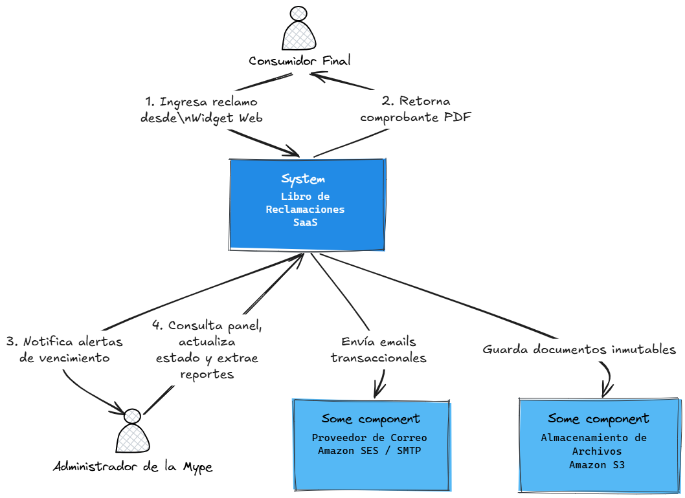

# Libro de Reclamaciones Inteligente (SaaS)

Sistema de gestión automatizada de cumplimiento normativo (Indecopi) diseñado para Mypes peruanas, construido con arquitectura multi-tenant.

---

## arc42 Documentación de Arquitectura

### 1. Introducción y Objetivos

#### 1.1 Contexto del Negocio y Requerimientos Principales
En el Perú, el Código de Protección y Defensa del Consumidor (y sus recientes modificatorias como la Ley N° 31435) obliga a toda empresa que ofrezca bienes o servicios a contar con un Libro de Reclamaciones y responder en un plazo máximo de **15 días hábiles**.

Las Mypes con presencia digital suelen gestionar esto mediante formularios básicos (Google Forms, correos electrónicos), lo que genera un alto riesgo de:
- Pérdida de tickets por desorganización.
- Vencimiento de plazos legales que resultan en multas severas por parte de Indecopi (hasta 450 UIT).
- Ausencia de pruebas o trazabilidad en caso de una auditoría estatal.

Este proyecto propone la construcción de un **SaaS B2B Multi-tenant** que centralice la recepción de quejas, automatice la emisión de constancias legales en PDF (Hoja de Reclamación) y orqueste un sistema de alertas proactivas para prevenir infracciones.

#### 1.2 Metas de Calidad (Quality Goals)
Las decisiones de arquitectura estarán impulsadas por los siguientes atributos de calidad, ordenados por prioridad:

1. **Aislamiento y Privacidad (Seguridad):** Al procesar Datos Personales (DNI, teléfonos, correos), el sistema debe cumplir con la Ley N° 29733 (Ley de Protección de Datos Personales). Los datos del *Tenant A* (Empresa 1) deben estar estrictamente aislados del *Tenant B* (Empresa 2).
2. **Trazabilidad (Auditoría):** Toda acción sobre un reclamo (cambio de estado, lectura, respuesta) debe generar un registro inmutable. El sistema debe poder probar ante Indecopi que la empresa gestionó el reclamo a tiempo.
3. **Fiabilidad (Reliability):** Un reclamo enviado por el consumidor no puede perderse bajo ninguna circunstancia (fallos de red o caídas del servidor). Debe garantizarse el registro de la transacción.
4. **Usabilidad de Integración:** La adopción del producto por parte de la Mype debe ser "Zero-IT". La inserción del formulario en sus tiendas web debe lograrse copiando y pegando un único *script* o etiqueta HTML.

#### 1.3 Stakeholders Principales
- **Dueño / Administrador de la Mype:** Busca cumplimiento legal automático, cero fricción de instalación técnica y alertas preventivas.
- **Consumidor Final:** Requiere un canal formal, ágil, responsivo y con un comprobante legal inmediato (código correlativo en PDF).
- **El Regulador (Indecopi):** Actor pasivo. Dicta las reglas de estructura de datos, formatos de exportación requeridos y plazos que el software debe cumplir.

### 2. Restricciones de la Arquitectura

Las decisiones de diseño de este sistema están limitadas por normativas gubernamentales peruanas y decisiones tecnológicas estratégicas para la fase de Producto Mínimo Viable (MVP).

#### 2.1 Restricciones Legales y Regulatorias
*   **Código de Protección y Defensa del Consumidor (Ley N° 29571 y modificatorias - Indecopi):**
    *   El sistema debe forzar la captura de campos obligatorios estandarizados (Datos del Consumidor, Datos del Bien/Servicio contratado, Detalle de la Reclamación/Queja).
    *   Debe generar automáticamente un código correlativo inalterable y secuencial por empresa (ej. `2026-000001`).
    *   Obligatoriedad de emitir y enviar una "Hoja de Reclamación" en formato inalterable (PDF) de manera inmediata al consumidor tras el registro.
*   **Ley de Protección de Datos Personales (Ley N° 29733):**
    *   Almacenamiento y tratamiento seguro de PII (Personal Identifiable Information) como DNI, CE, nombres, teléfonos y direcciones.
    *   El formulario web debe incluir obligatoriamente un *checkbox* de consentimiento para el tratamiento de datos personales, cuyo registro (fecha y hora) debe auditarse en la base de datos.

#### 2.2 Restricciones Técnicas
*   **Stack Tecnológico Base:** El backend debe desarrollarse utilizando **Java y Spring Boot**. La persistencia de datos relacionales y transaccionales se manejará en **PostgreSQL**.
*   **Aislamiento Multi-tenant:** Para optimizar costos en la fase MVP, se utilizará una arquitectura de base de datos de instancia única con separación lógica por inquilino (*Logical Isolation* usando `tenant_id` o esquemas separados), garantizando que las consultas nunca filtren datos entre empresas.
*   **Infraestructura:** El despliegue se realizará en contenedores utilizando **Docker** para garantizar consistencia entre entornos. El aprovisionamiento de la nube (**AWS**) deberá estar codificado utilizando **Terraform** (Infraestructura como Código - IaC).

#### 2.3 Restricciones Organizacionales y de Negocio
*   **Costos Operativos (Fase MVP):** La arquitectura inicial debe diseñarse para minimizar el gasto mensual en infraestructura de nube, prefiriendo servicios gestionados dentro de la capa gratuita (*Free Tier*) de AWS (como EC2 t2.micro, RDS micro, o alternativas serverless) durante las pruebas piloto con los primeros clientes.
*   **Equipo de Desarrollo:** Al ser desarrollado por un equipo reducido (un solo Ingeniero de Software), se priorizará la mantenibilidad, el código limpio y la automatización del despliegue (CI/CD) sobre optimizaciones de micro-rendimiento que añadan complejidad innecesaria en esta etapa.

### 3. Contexto y Alcance

Esta sección define los límites del sistema "Libro de Reclamaciones SaaS", identificando las interacciones con usuarios humanos y sistemas externos.

#### 3.1 Diagrama de Contexto (Business Context)

El siguiente diagrama muestra las entradas y salidas principales del sistema:

#### 3.2 Descripción de Actores y Sistemas Externos

**Actores Humanos:**
*   **Consumidor Final:** Usuario externo que interactúa únicamente con el formulario incrustado en la web de la Mype. Su flujo termina al recibir la confirmación y su comprobante PDF.
*   **Administrador de la Mype (Tenant):** Usuario autenticado que ingresa al panel de control (Dashboard) para gestionar los tickets de su empresa, redactar respuestas y descargar reportes obligatorios para Indecopi.

**Sistemas Externos (Dependencias):**
*   **Servicio de Correo Electrónico (Ej. Amazon SES / SMTP):** El sistema depende de una API de terceros para el envío transaccional de correos. Es crítico, ya que la ley exige que el consumidor reciba su constancia.
*   **Almacenamiento de Archivos (Ej. Amazon S3):** Sistema externo utilizado para almacenar de forma segura y duradera los PDFs generados y la evidencia adjunta (imágenes/documentos).

#### 3.3 Alcance de la Interfaz Técnica
*   La comunicación entre el widget web y el backend se realizará a través de una **API RESTful** expuesta bajo el protocolo HTTPS.
*   El sistema será completamente autocontenido en la gestión de tickets. No se integrará con pasarelas de pago, facturadores electrónicos ni CRMs externos en esta fase del MVP.

### 4. Estrategia de Solución
*(Por definir: cómo usaremos Java, Spring Boot, PostgreSQL multi-tenant y AWS/Terraform para resolver el problema).*

### 5. Vista de Bloques (Componentes)
*(Por definir: la separación entre la API, la Base de Datos y los Workers asíncronos).*

### 6. Vista de Ejecución (Runtime)
*(Por definir: cómo fluye la información desde que el cliente envía el reclamo hasta que se guarda y notifica).*

### 7. Vista de Despliegue
*(Por definir: la infraestructura en AWS utilizando contenedores Docker).*

### 8. Conceptos Transversales
*(Por definir: manejo de excepciones, seguridad de base de datos multi-tenant y auditoría de tickets).*

### 9. Decisiones de Arquitectura (ADRs)
*(Aquí documentaremos decisiones clave como por qué elegimos aislamiento lógico de BD en lugar de físico).*

---